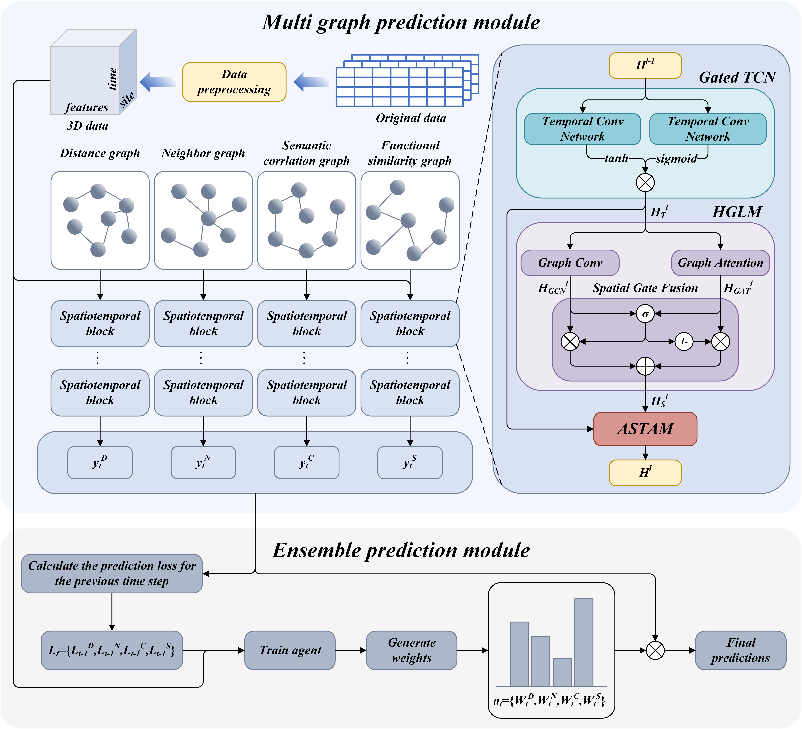
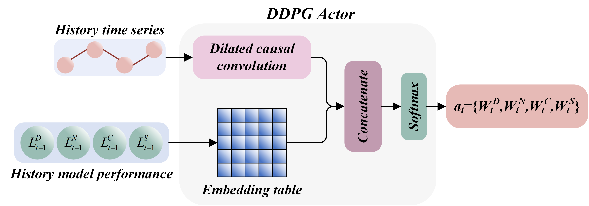
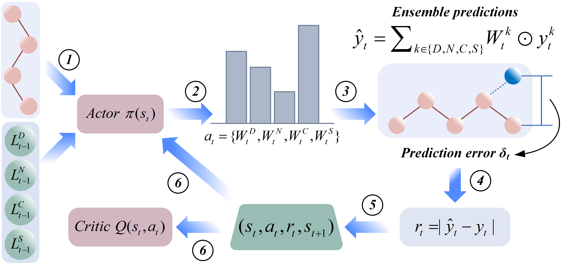

# DMGENet

**Dynamic Multi-Graph Ensemble Neural Network for Short-Term Air Quality Forecasting**

---

## 📝 Abstract

Air quality forecasting plays a crucial role in urban environmental management and public health protection. However, existing methods still face challenges in modeling complex spatiotemporal relationships, integrating multi-source spatial information, and achieving dynamic adaptability. To address these issues, this paper proposes a Dynamic Multi-Graph Ensemble Neural Network (DMGENet) for short-term air quality forecasting. Specifically, multiple spatial graph structures are constructed from four perspectives—geographical distance, adjacency, semantic correlation, and functional similarity—to comprehensively encode spatial dependencies between monitoring stations. Subsequently, a novel spatiotemporal feature extraction framework is designed by integrating gated temporal convolution with a hybrid graph learning module, along with an adaptive spatiotemporal attention mechanism to effectively tackle spatiotemporal heterogeneity. Finally, a dynamic ensemble method based on an improved deep reinforcement learning strategy is introduced to adaptively combine the prediction results of multiple graph models, thereby enhancing model flexibility and forecasting accuracy. Experimental results show that, for the 6-hour ahead forecasting task, the proposed model achieves average reductions of 11.44% and 17.10% in RMSE, and 12.50% and 18.54% in MAE, compared to GC-LSTM and LSTM, demonstrating its superior performance and robustness in short-term air quality forecasting.

---

## 🚀 Key Contributions

1. **Multi-Graph Construction**  
   We propose a multi-graph construction method that encodes diverse inter-station spatial relationships, thereby providing the model with richer prior structural information.

2. **Spatiotemporal Feature Extraction Module**  
   We develop a novel spatiotemporal feature extraction module that integrates a **Gated Temporal Convolutional Network (Gated TCN)** and a **Hybrid Graph Learning Module (HGLM)** to separately capture temporal and spatial dependencies, and further incorporates an **Adaptive Spatiotemporal Attention Mechanism (ASTAM)** to effectively address the inherent spatiotemporal heterogeneity in air quality prediction.

3. **Dynamic Ensemble via Reinforcement Learning**  
   We introduce a dynamic multi-graph ensemble method based on an improved **Deep Deterministic Policy Gradient (DDPG)** algorithm to adaptively integrate predictions from multiple graph-based models, thereby improving overall forecasting performance.

---

## 📊 Dataset Description

We evaluate DMGENet on several publicly available real-world datasets widely used in air quality and traffic forecasting research:

- **PEMS03, PEMS04, PEMS07, PEMS08**  
  Traffic flow and air quality sensor data collected from highway sensor networks in California, USA, each dataset covering different regions with varying numbers of sensors.

- **Beijing PM2.5 Dataset**  
  Hourly PM2.5 concentration data collected from multiple monitoring stations in Beijing, China, including meteorological factors such as temperature, humidity, and wind speed.

All datasets include spatial coordinates of monitoring stations, temporal sequences of measurements, and auxiliary features. Standard preprocessing such as normalization and missing data handling is applied.

---

## 🧩 Model Diagrams

### Overall Framework of DMGENet

  
*A unified architecture consisting of multi-graph constructor, spatiotemporal encoder (Gated TCN + HGLM + ASTAM), and a reinforcement-learning-based ensemble controller.*

---

### Adaptive Spatiotemporal Attention Mechanism (ASTAM)

<p align="center">
  
</p>  
*Captures spatiotemporal heterogeneity by assigning dynamic attention weights across spatial and temporal dimensions.*

---

### DDPG Actor Network in RLMC

  
*Learns to generate dynamic fusion weights for multi-graph outputs during ensemble prediction.*

---

### Training Pipeline of RLMC

  
*Illustrates the training process of the Reinforcement Learning-based Multi-Graph Controller using improved DDPG.*

---

## ⚙️ Installation

1. Clone the repository:  
   ```bash
   git clone https://github.com/yourusername/DMGENet.git
   cd DMGENet
