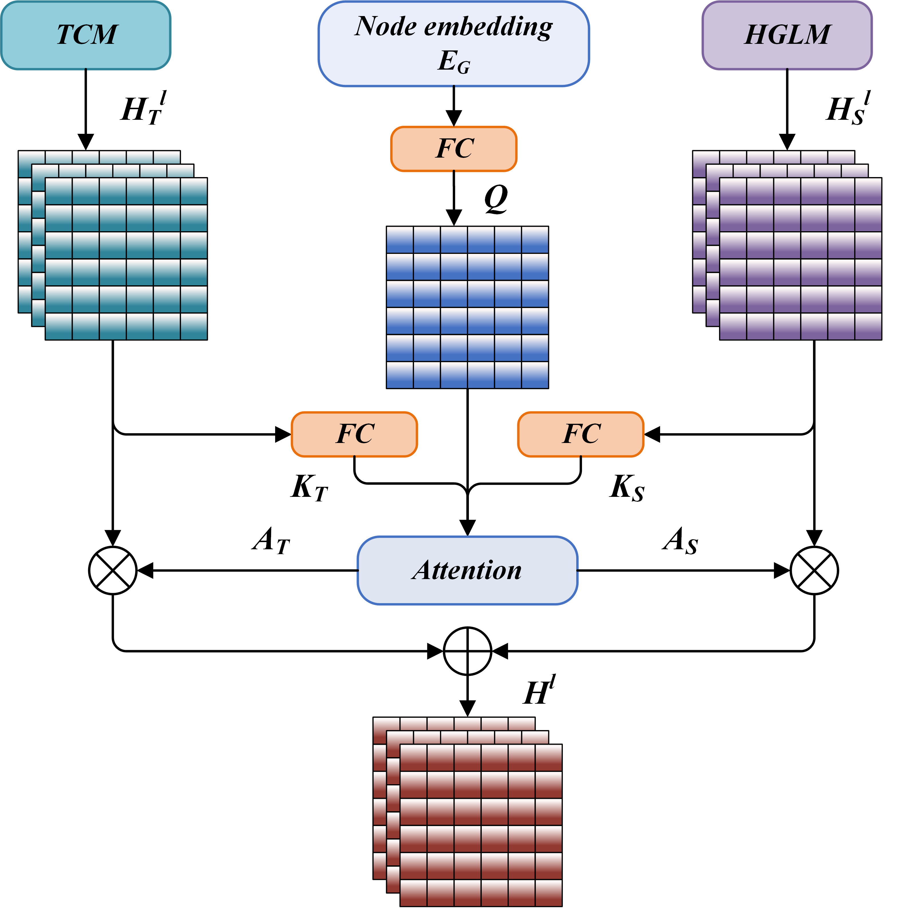

# 🌫️ DMGENet

**Dynamic Multi-Graph Ensemble Neural Network for Short-Term Air Quality Forecasting**

---

## 📝 Abstract

## 📝 Abstract

We propose **DMGENet** (Dynamic Multi-Graph Ensemble Neural Network), a novel architecture that integrates multi-graph structural modeling, spatiotemporal attention mechanisms, and a reinforcement learning-based ensemble strategy for accurate short-term air quality forecasting. By combining heterogeneous spatial dependencies and dynamic temporal patterns, DMGENet achieves superior predictive performance and strong adaptability in real-world scenarios.
---

## 📊 Dataset

The air quality data is collected from **12 observing stations** around **Beijing**, covering the years **2013–2017**.  
It includes hourly measurements of various air pollutants and meteorological variables.  
The dataset is publicly available from the [UCI Machine Learning Repository](http://archive.ics.uci.edu/ml/).

---

## 🚀 Key Contributions

1. **Multi-Graph Construction**  
   A novel construction method encodes diverse inter-station spatial relationships, providing the model with richer prior structural information.

2. **Spatiotemporal Feature Extraction Module**  
   A hybrid module that combines a **Gated Temporal Convolutional Network (Gated TCN)** and a **Hybrid Graph Learning Module (HGLM)** to separately capture temporal and spatial dependencies, enhanced by an **Adaptive Spatiotemporal Attention Mechanism (ASTAM)** to address spatiotemporal heterogeneity.

3. **Dynamic Ensemble via Reinforcement Learning**  
   A dynamic ensemble strategy using an improved **Deep Deterministic Policy Gradient (DDPG)** algorithm to adaptively fuse outputs from multiple graph-based models.

---

## 🧩 Model Architecture

### 🔷 Overall Framework of DMGENet

  
*The proposed DMGENet mainly consists of two components: the Multi-Graph Prediction Module and the Ensemble Prediction Module.*

---

### 🔶 Adaptive Spatiotemporal Attention Mechanism (ASTAM)

  

  
*Captures spatiotemporal heterogeneity by assigning dynamic attention weights across spatial and temporal dimensions.*

---

### 🧠 DDPG Actor Network in RLMC

  
*Learns to generate dynamic fusion weights for multi-graph outputs during ensemble prediction.*

---

### 🛠️ Training Pipeline of RLMC

  
*Illustrates the training process of the Reinforcement Learning-based Multi-Graph Ensemble Method using improved DDPG.*

---
